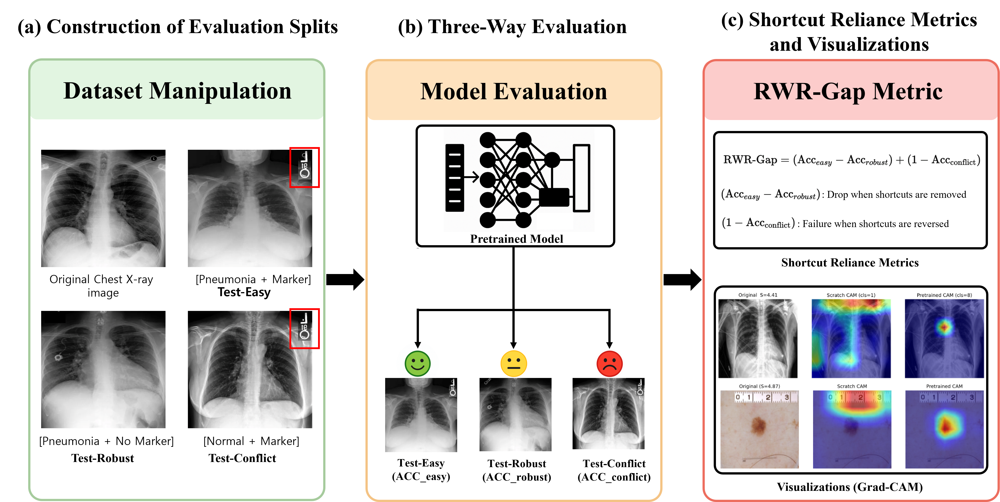

# RWR-Gap: Conflict-Benchmarks for Evaluating Shortcut Reliance in Medical Imaging

Official implementation of **"RWR-Gap: Conflict Benchmarking Medical Shortcut Reliance"**

<div align="center">
  
</div>

## Overview

**RWR-Gap** introduces a unified benchmark for quantifying shortcut reliance in medical imaging models.  
Shortcut dependence is revealed by evaluating deep neural networks under **controlled shortcut injection**  
and across **conflict-based test splits**:

1. **Easy Split** – shortcut and label aligned  
2. **Robust Split** – no injected shortcuts  
3. **Conflict Split** – shortcut conflicts with label to expose model biases

Our benchmark supports:

- **CXR (MIMIC-CXR)** and **ISIC Skin Lesion** datasets  
- **ResNet / DenseNet / ViT / CXR-pretrained models**  
- **0/25/50/75/100% marker injection ratios**  
- **Grad-CAM triplet visualization**  
- **Marker energy analysis & RWR state tracking**

| Module | Objective |
|--------|-----------|
| [Injection Pipelines](./data/) | Controlled marker overlay & split generation |
| [Training Scripts](./train/)   | Baseline / Shortcut / Injection training |
| [Analysis Tools](./analysis/)  | Grad-CAM, energy analysis, RWR state tracking |

---

## Installation
```bash
conda create -n rwr-gap python=3.10
conda activate rwr-gap

git clone https://github.com/moodo37/RWR-Gap.git
cd RWR-Gap

pip install -r requirements.txt
pip install torchxrayvision
pip install timm
```

## Quick Start
### 1. Train on CXR (Baseline)
```bash
cd train
python train_cxr_rwr_gap.py \
    --train_mode baseline \
    --arch resnet50 \
    --pretrain imagenet
```

### 2. injection-strength ablations (0/25/50/75/100%):
```bash
for p in 0 25 50 75 100; do
    python train_cxr_rwr_gap_injection.py \
        --train_mode injection \
        --inject_p $p \
        --arch resnet50 \
        --pretrain imagenet
done
```

### 3. Visualize Grad-CAM Triplets on CXR
```bash
cd ../analysis
python generate_cam_triplets_cxr.py
```